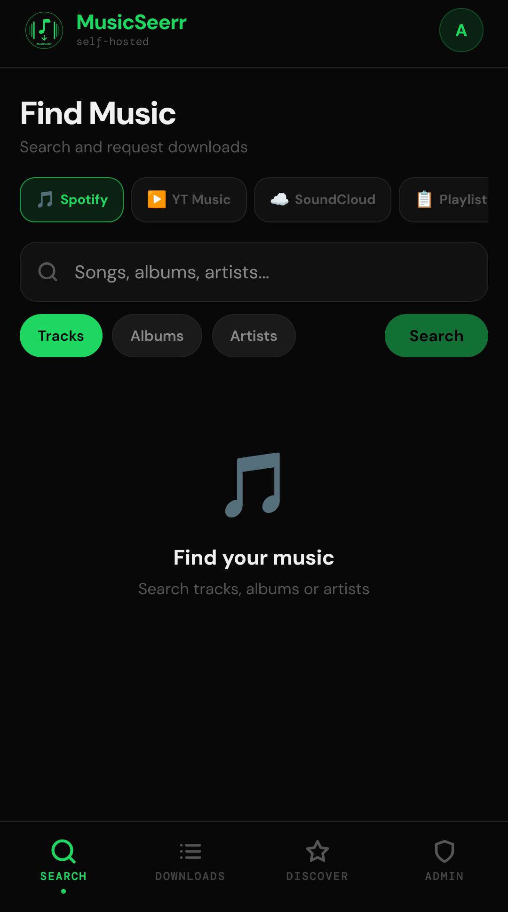
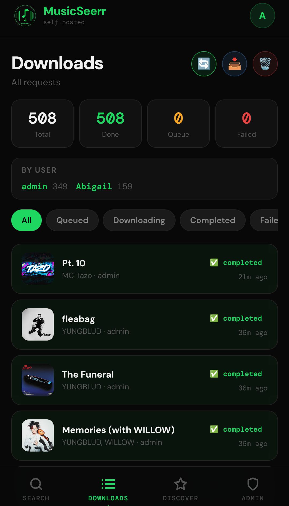
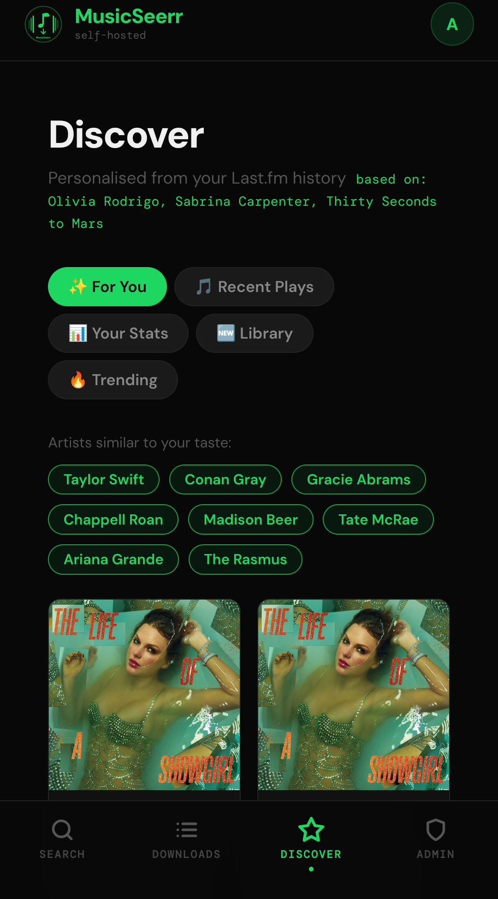
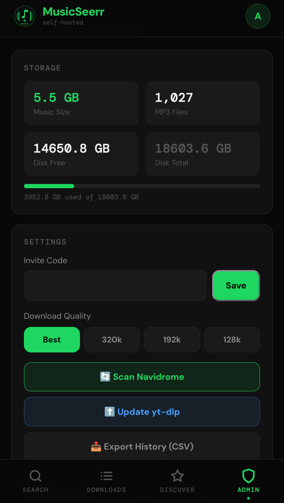

# 🎵 MusicSeerr

> The Overseerr of music. Search Spotify, YouTube Music and SoundCloud, request downloads for your household, and stream via Navidrome or any Subsonic-compatible player.

Built as a self-hosted Spotify replacement for home use. Family members search for music, click download, and it automatically appears in your music library — with album art, correct metadata and Navidrome playlists created automatically.

---

## Screenshots

<p align="center">
  
  
  
  
</p>

*Search · Downloads · Discover · Admin*

---

## Features

### 🔍 Search
- **Spotify** — search tracks, albums and artists with full metadata
- **YouTube Music** — find live versions, covers, remixes and anything not on Spotify
- **SoundCloud** — download tracks, DJ mixes and podcasts
- **Artist browse** — tap any artist to browse their full discography
- **Album download** — download an entire album in one tap

### 📋 Playlists
- Import **Spotify** and **YouTube** playlists with one paste
- Playlist **auto-monitoring** — new tracks added to your Spotify playlists are automatically downloaded every 6 hours
- **Sync Now** button for manual refresh
- Navidrome **M3U playlist** created automatically on import

### ⬇️ Downloads
- Downloads via **yt-dlp** with correct Spotify metadata embedded
- **Album art** fetched and embedded from Spotify
- **No duplicates** across all users — shared library awareness
- **Auto-retry** failed downloads every 30 minutes
- **Per-user history** — family members only see their own requests
- **Export** full download history as CSV
- Filter by status: Queued · Downloading · Completed · Failed

### ✨ Discover
- Personalised **Last.fm recommendations** based on your listening history
- **For You** — tracks from similar artists
- **Recent Plays** — your scrobble history
- **Your Stats** — top tracks and artists by time period
- **Trending** — most requested tracks across all users

### 👑 Admin
- **Storage stats** — music folder size, MP3 count, disk usage
- **Download quality** — Best / 320k / 192k / 128k
- **User management** — set per-user daily request limits
- **Blacklist** — block artists or tracks from being downloaded
- **yt-dlp auto-update** — daily updates to prevent YouTube breakage
- **Manual Navidrome scan** — trigger library refresh instantly
- **Invite code** management

### 🔐 Auth
- Invite code registration — users need a code to join
- First registered user is automatically admin
- JWT-based auth with 30 day sessions
- Daily request limits per user

### 📱 Mobile
- Mobile-first UI with bottom navigation
- PWA support — installable on iOS and Android home screen
- Large touch targets throughout

---

## Requirements

- Docker and Docker Compose
- A **Spotify Developer** account (free) — for searching music
- A music folder accessible to the container
- Optionally: Navidrome for streaming, Last.fm for recommendations

---

## Quick Start

### 1. Clone the repo

```bash
git clone https://github.com/ipillyx/musicseerr.git
cd musicseerr
```

### 2. Create your `.env` file

```bash
cp .env.example .env
nano .env
```

### 3. Fill in your `.env`

```env
# Required
SECRET_KEY=your-random-secret-key        # openssl rand -hex 32
INVITE_CODE=YOURCODE
SPOTIFY_CLIENT_ID=your-spotify-client-id
SPOTIFY_CLIENT_SECRET=your-spotify-client-secret
MUSICSEERR_PORT=8810

# Optional — Discord notifications
DISCORD_WEBHOOK=https://discord.com/api/webhooks/your/webhook

# Optional — Navidrome auto-scan after downloads
NAVIDROME_URL=http://your-navidrome-ip:4533
NAVIDROME_USER=admin
NAVIDROME_PASS=your-navidrome-password

# Optional — Last.fm personalised recommendations
LASTFM_API_KEY=your-lastfm-api-key
LASTFM_USER=your-lastfm-username

# Optional — daily request limit per user (default: 50)
MAX_DAILY_REQUESTS=50
```

### 4. Set your music folder

Edit `docker-compose.yml` and update the music volume:

```yaml
volumes:
  - musicseerr-data:/data
  - /path/to/your/music:/music    # change this
```

### 5. Build and run

```bash
docker compose up -d --build
```

First build takes around 5 minutes — installs ffmpeg, yt-dlp and all dependencies.

### 6. Open in your browser

```
http://your-server-ip:8810
```

- Register at `/register` — **first user is automatically admin**
- Share your `INVITE_CODE` with family so they can register

---

## Spotify API Setup

1. Go to [developer.spotify.com/dashboard](https://developer.spotify.com/dashboard)
2. Click **Create App**
3. Set the redirect URI to `http://localhost`
4. Copy **Client ID** and **Client Secret** into `.env`

---

## Navidrome Integration

When `NAVIDROME_URL`, `NAVIDROME_USER` and `NAVIDROME_PASS` are set:

- Library scan triggered automatically after each download
- Playlists created as M3U files and auto-imported into Navidrome
- Monitored Spotify playlists sync new tracks and update playlists automatically

---

## Last.fm Recommendations

Set `LASTFM_API_KEY` and `LASTFM_USER` to unlock the Discover page:

| Tab | Description |
|-----|-------------|
| ✨ For You | Tracks from similar artists based on your Last.fm history |
| 🎵 Recent Plays | Your recent scrobble history |
| 📊 Your Stats | Top tracks and artists by time period |
| 🆕 Library | Recently downloaded to your library |
| 🔥 Trending | Most requested tracks across all users |

Get a free Last.fm API key at [last.fm/api/account/create](https://www.last.fm/api/account/create).

---

## Homepage Dashboard Widget

MusicSeerr exposes a public stats endpoint for use with [Homepage](https://gethomepage.dev):

```yaml
- MusicSeerr:
    icon: https://your-server/icon-192x192.png
    href: http://your-server:8810
    description: Music download requests
    widget:
      type: customapi
      url: http://your-server:8810/api/public/stats
      refreshInterval: 60000
      mappings:
        - field: completed
          label: Downloaded
          format: number
        - field: queued
          label: In Queue
          format: number
        - field: users
          label: Users
          format: number
```

---

## Playlist Monitoring

Import a Spotify or YouTube playlist and MusicSeerr will:

1. Download all tracks immediately
2. Create a Navidrome playlist automatically
3. Check the playlist every 6 hours for new tracks
4. Auto-download any new additions

Use the **Playlist** tab → **Saved** to see all monitored playlists and trigger manual syncs.

---

## iOS / Android

MusicSeerr is a PWA — install it as an app:

1. Open Safari/Chrome and go to your MusicSeerr URL
2. Tap **Share** → **Add to Home Screen**
3. Tap **Add**

For listening to your library on mobile, use any Subsonic-compatible app pointed at your Navidrome server:
- **Substreamer** (iOS/Android) — free
- **Symfonium** (Android) — paid, excellent

---

## Updating

```bash
git pull
docker compose down
docker compose up -d --build
```

---

## Stack

| Component | Technology |
|-----------|------------|
| Backend | FastAPI + SQLite |
| Frontend | React + Vite |
| Downloads | yt-dlp |
| Metadata | Spotify API + mutagen |
| Recommendations | Last.fm API |
| Deployment | Docker Compose |

---

## Contributing

PRs and issues welcome! This started as a personal homelab project.

---

## License

MIT
